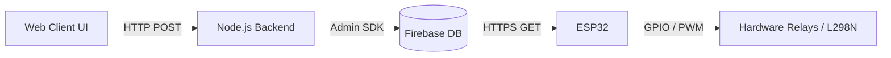

# NEXUS — Smart Home IoT System

Welcome to the **NEXUS Smart Home** project! This repository contains a full-stack IoT solution for controlling home appliances (LEDs and motorized fans) from anywhere in the world using a premium web dashboard. 

## 🏗️ System Architecture

The project relies on a modern, decoupled architecture using three main components:

1. **Hardware (ESP32):** An Arduino-programmed ESP32 microcontroller physically wired to LEDs and an L298N motor driver. It connects to Wi-Fi and securely polls the Firebase Realtime Database for state changes.
2. **Backend (Node.js & Express):** A lightweight API server that handles all requests from the frontend web interface, strictly validates data types, and pushes partial updates securely to Firebase using the Admin SDK.
3. **Frontend (HTML/JS/CSS):** A gorgeous, responsive web dashboard with live-reloading UI. It features real-time synchronization, toggle switches, and fan-speed sliders wrapped in a dark-themed "quiet luxury" aesthetic.



## 🛠️ Technology Stack

- **Microcontroller:** ESP32 (Arduino Core 3.x)
- **Backend:** Node.js, Express.js, Firebase-Admin
- **Frontend:** Vanilla HTML, CSS (Syne & DM Sans fonts), JavaScript (Fetch API)
- **Database:** Firebase Realtime Database

## 🗃️ Firebase Data Structure
The entire state of the smart home is securely synchronized using the following JSON tree:

```json
{
  "home": {
    "led1": true,
    "led2": false,
    "fan1": {
      "state": "on",
      "speed": 75
    },
    "fan2": {
      "state": "off",
      "speed": 0
    }
  }
}
```

## 🚀 Setup & Installation

### 1. Database Setup
1. Create a Firebase project and enable the **Realtime Database**.
2. Navigate to `Project Settings -> Service Accounts` and generate a new private key.
3. Place the downloaded `.json` key into the `backend/` directory.

### 2. Backend Initialization
1. Navigate to the backend directory:
   ```bash
   cd backend
   ```
2. Install dependencies:
   ```bash
   npm install
   ```
3. Update `server.js` with your specific Firebase Realtime Database URL.
4. Run the server using nodemon for hot-reloading:
   ```bash
   npm run dev
   ```

### 3. ESP32 Hardware Setup
1. Open `Smart-house.ino` in the Arduino IDE.
2. Update the `ssid` and `password` with your local Wi-Fi credentials.
3. Update the `url` constant with your Firebase Database REST endpoint (`.../home.json`).
4. Wire your hardware according to the defined pins:
   - **LED 1:** Pin 2
   - **LED 2:** Pin 4
   - **L298N Motor 1:** IN1(18), IN2(19), ENA(5)
   - **L298N Motor 2:** IN3(21), IN4(22), ENB(23)
5. Flash the code to the ESP32!

## ✨ Features
- **Auto-Initialization:** The backend automatically boots up with default states if the database is empty, preventing fatal null-reference crashes.
- **Robust Memory Allocation:** The ESP32 utilizes a highly optimized `DynamicJsonDocument(1024)` to safely parse nested objects without memory fragmentation.
- **Fail-Safe Mechanism:** If the ESP32 loses connection to Firebase for over 15 seconds, a fail-safe engages, automatically cutting power to the motors to prevent hardware damage.
- **Synchronized UI:** If physical buttons or other devices modify Firebase, the Web UI will seamlessly update its visual toggles and sliders within seconds to reflect the true state of the house.
